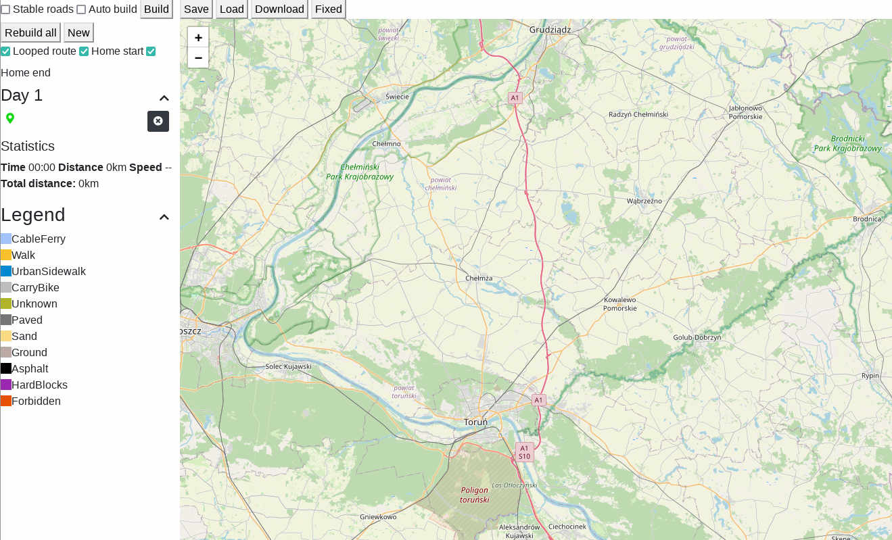
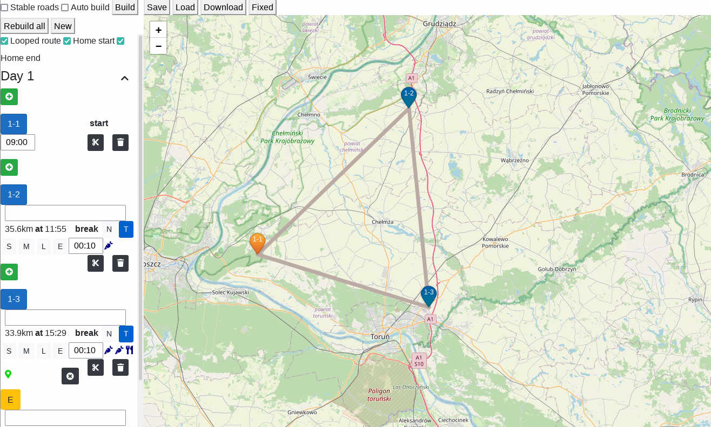
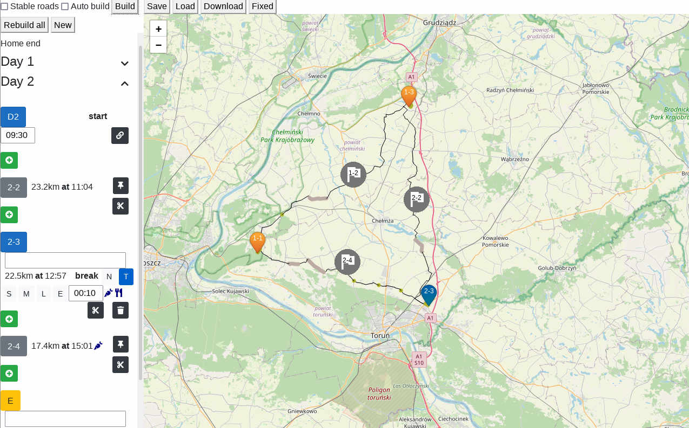

## Basic steps

### UI overview

When you first hit the track planner address you will see page like the above. Now, what it is interesting here:

* stable roads -- when enabled will limit planning to well established roads (no wild tracks, or similar),
* auto build -- will skip the draft phase and compute the plan right away,
* build -- will build the drafted legs of the plan,
* rebuild all -- will rebuild entire plan,
* looped route -- will add the last leg to the starting point automatically,
* home start -- indicates you are not starting from the woods,
* home end -- same as above but for the end,
* save/load -- works as you expect,
* the green pin (on the left) -- indicates the position within the plan when the user point will be inserted.
You can click on the map for adding new point, or you can click on the pin itself and give exact coordinates.

### Planning

Without altering any default options please click three times on the map to create triangle-like route. At first it is merely a draft:

But even this will give you and idea how long your ride will be, and drafted or not you can already organize your ride into days.
So click on the scissors icon at the middle point. We just divided our ride into two days. Click "rebuild all" and voilà, we have
our first planned trip:

You can alter how much time you would like to spend at given place by clicking on predefined break times or you can enter time directly.
Planner takes such events like snack times, lunch, laundry, resupplies into consideration when computing time, as well the fatigue.
Below each day you can read statistics.

Please note the checkpoints with the flags, which obviosuly you didn't add by hand. Those are auto-checkpoints added for easier measuring
ride progress while you are in the wild (it is more comfortable to be 20 minutes until next checkpoint than 4 hours, thus by default they are
densely placed, but of course you can change the config to your liking). If you would like to change auto checkpoint into permanent one (to add
a note for it or change break time) pin it down.

To avoid loosing you precisely crafted plan save it often. When you save it you will get:
* the plan file -- it is a core data file, 
* the summary -- html file per each day with summary so on ride you can inspect it and check if you are behind the schedule or not,
* track file -- two per each day. One includes only checkpoints so it easy to read (you can convert it to GPX format and load it to OsmAnd
for example). The second one includes turns -- its purpose is to convert it to GPX and load into TrackRadar.

